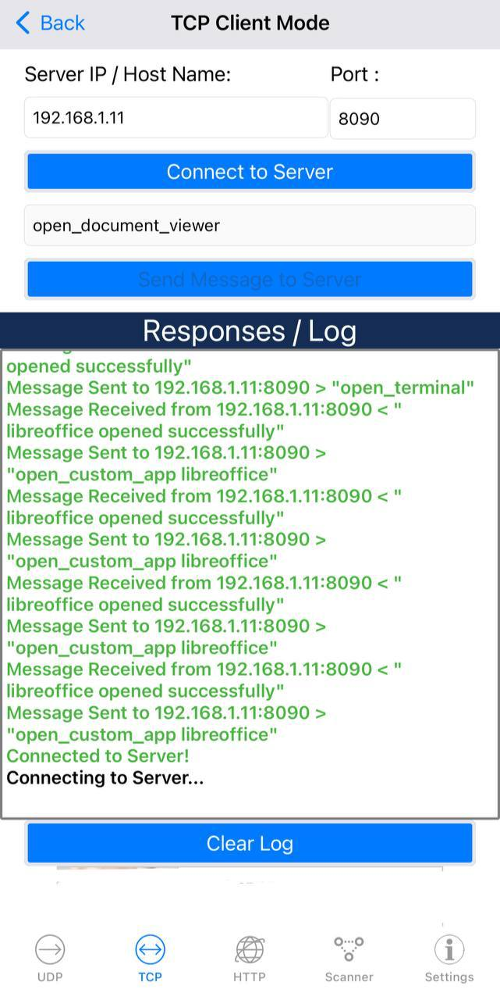

# PC Control 

### **Overview**
The server-client system utilizes TCP for reliable command transmission. Commands from the client control applications on the server, with responses provided by the server based on socket .

### **Protocol Used**

#### **TCP (Transmission Control Protocol)**
- **Connection-oriented**: Ensures a stable connection for data transfer.
- **Reliable**: Handles packet delivery and order.
- **Use Cases**: Suitable for tasks needing guaranteed communication, like opening applications.

#### **Difference between TCP and UDP**
- **TCP**: Connection-oriented, reliable, and ensures data integrity.
- **UDP**: Connectionless, faster but less reliable, suitable for real-time applications where occasional data loss is acceptable.
-  https://www.youtube.com/watch?v=bDjP6bQLy3M

### **Client App**
- **iOS**: [App Link](https://apps.apple.com/eg/app/udp-tcp-rest-network-utility/id1246823651)
- **Android**: [App Link](https://play.google.com/store/apps/details?id=tcpudpserverclient.steffenrvs.tcpudpserverclient)
- **IP Retrieval Command**: `hostname -I`

### **Steps to Use**
1. Choose TCP client on your app.
2. Input the server’s IP address and port number.
3. Connect to the server (make sure the server is running).
4. Send commands to control the server.
#### **client**

#### **server**
[from minute 1:30 ] [LInk](https://drive.google.com/file/d/1GysYF2xKUVPETWl0R22yKSpMChsJLbU6/view?usp=sharing)

### **Commands**

- **open_terminal**: Opens the terminal.
- **open_calculator**: Opens the calculator.
- **open_firefox**: Opens Firefox.
- **open_text_editor**: Opens a text editor.
- **open_file_manager**: Opens the file manager.
- **open_music_player**: Opens the music player.
- **open_vscode**: Opens Visual Studio Code.
- **open_document_viewer**: Opens the document viewer.
- **open_custom_app <app_name>**: Opens a custom app specified by `<app_name>`.
- **exit**: Closes the server connection.

### **Troubleshooting**

- **Connection Issues**: Ensure server is active and reachable. Check firewall settings and network configurations.
- **Command Not Working**: Verify correct command syntax and ensure required applications are installed on the server.

### This might help
-https://www.geeksforgeeks.org/socket-programming-in-cpp/

-https://www.geeksforgeeks.org/socket-programming-cc/

